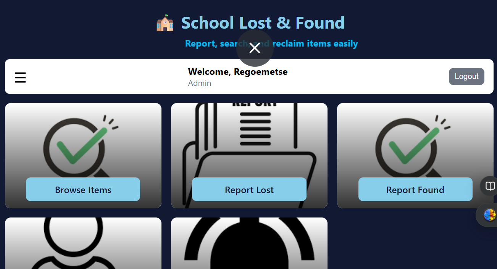

# COM2301GroupCProject

# 🏫 Lost and Found M.S



A client-side web application designed to help users (students, staff, or administration) report, search for, and match lost and found items within a school or campus environment. The system uses local browser storage for persistence, making it highly responsive and capable of working offline.

---

## 🚀 Live Demo

Check out the live application hosted on GitHub Pages:  
👉 [Lost and Found Management System](https://2400415.github.io/Lost-and-Found-management-system/)

---

## ✨ Features

- **User Authentication (Local):** Simple login and registration using browser storage.
- **Item Reporting:** Forms for reporting Lost and Found items with details, location, date, and image uploads.
- **Search & Filter:** Dashboard filtering by category, item name, and status (Lost/Found).
- **Real-time Matching:** Automatic notifications when items match across reports.
- **User Dashboard:** Centralized view of all reported items.
- **Responsive Design:** Optimized for mobile, tablet, and desktop devices.

---

## 🛠️ Technology Stack

- **HTML5:** Structure and content.
- **CSS3 (styles.css):** Custom styling for a modern, clean, and responsive UI.
- **JavaScript (script.js):** Application logic, state management, and localStorage-based persistence.
- **Font Awesome:** Iconography throughout the app.

---

## 📋 Installation and Setup

To run this project locally:

1. **Clone the repository:**
   ```bash
   git clone https://github.com/2400415/Lost-and-Found-management-system.git
## 🌿 Branch Overview

- `main`: Stable release version.
- `back-up`: previous versions branch.

